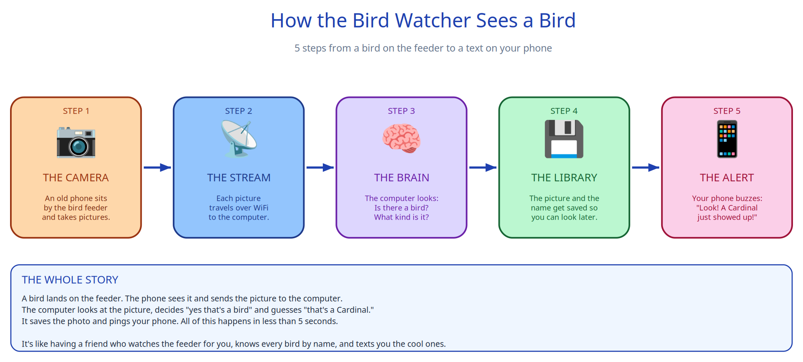

# Bird Watcher

A smart bird detection system that watches your bird feeder, identifies what shows up, and pings your phone.

Built as a tutorial — 10 issues, one piece at a time. Start at issue #1, work through them in order.

## The big picture



The pipeline has five boxes:

1. **THE CAMERA** — an old phone by the feeder takes pictures
2. **THE STREAM** — each picture travels over WiFi to the computer
3. **THE BRAIN** — the computer looks: is there a bird? what kind?
4. **THE LIBRARY** — the picture and the name get saved
5. **THE ALERT** — your phone buzzes: "Look! A Cardinal just showed up!"

## How the tutorial works

Every issue has:

- A small diagram showing **just this step's piece** in the bigger picture
- A Google Colab notebook you can run in your browser — zero install
- An acceptance criterion you can demo when you're done

Issues build on each other. After #10 you'll have a working bird watcher you can show off.

## The 10 issues

| # | What you'll build | Visible result |
|---|---|---|
| 1 | Project skeleton + dependencies | `python -m bird_watcher --version` |
| 2 | Open the camera stream | One snapshot saved to disk |
| 3 | Poll every N seconds | Timestamped jpgs accumulating |
| 4 | Detect: is there a bird? | `bird found at (x,y,w,h)` or `no bird` |
| 5 | Identify the species | `American Robin (0.92)` |
| 6 | Save sightings to a database | `SELECT * FROM sightings` |
| 7 | Slack notifications | Phone ping on test sighting |
| 8 | Web UI hello world | `localhost:8000` shows the title |
| 9 | Web UI gallery | Clickable image grid |
| 10 | Daily digest | Morning summary in Slack |

See the [Issues](../../issues) tab to start with #1.

## Repository layout

```
bird-watcher/
├── README.md              <- you are here
├── docs/                  <- diagrams live here
│   └── diagrams/
│       ├── 00-master.*    <- the big picture (kid-friendly)
│       ├── 00-technical.* <- the same thing, more detail
│       └── NN-step.*      <- one diagram per issue
├── tutorials/             <- colab notebooks (one per step)
├── src/
│   └── bird_watcher/      <- production code grows here
└── data/                  <- snapshots get saved here
```

## Contributing

Each issue is its own GitHub Issue. Claim one, follow its notebook, demo the acceptance criterion, open a PR.

Issues are designed to take one sitting each.

---

Built with love for two 14-year-olds learning how a real software system comes together. 🐦